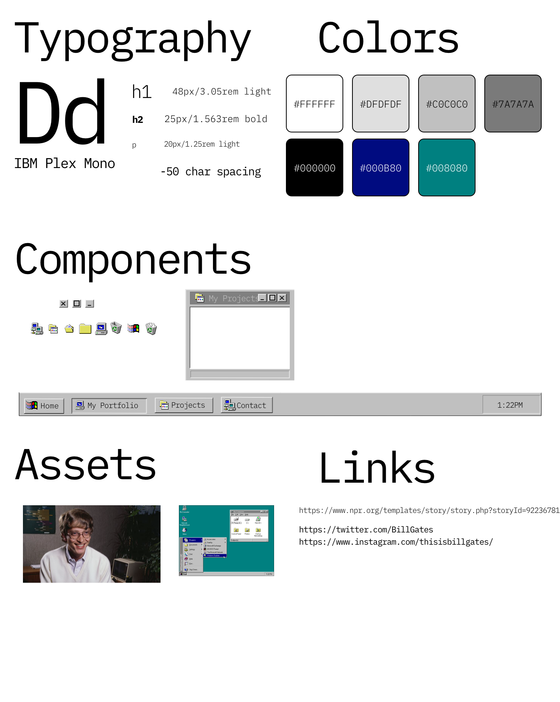

# My [FreeCodeCamp](https://www.freecodecamp.org/pineapplegiant) Portfolio Design Page 🖥 
[Neovim is the hero](https://img.shields.io/badge/made%20with-neovim%E2%9D%A4%EF%B8%8F-blue)

    

## Style Guide

    

## Tools

* Editor - [Neovim](https://neovim.io/)
* Design - [Adobe XD](https://www.adobe.com/products/xd.html)
* Typography:
    - [IBM Plex Mono](https://fonts.google.com/specimen/IBM+Plex+Mono)
* Special Nuggets I learned:
    - [Javascript Responsive components -> ResizeObserver](https://philipwalton.com/articles/responsive-components-a-solution-to-the-container-queries-problem/)
    - [Draggable Elements](https://www.w3schools.com/howto/howto_js_draggable.asp)
